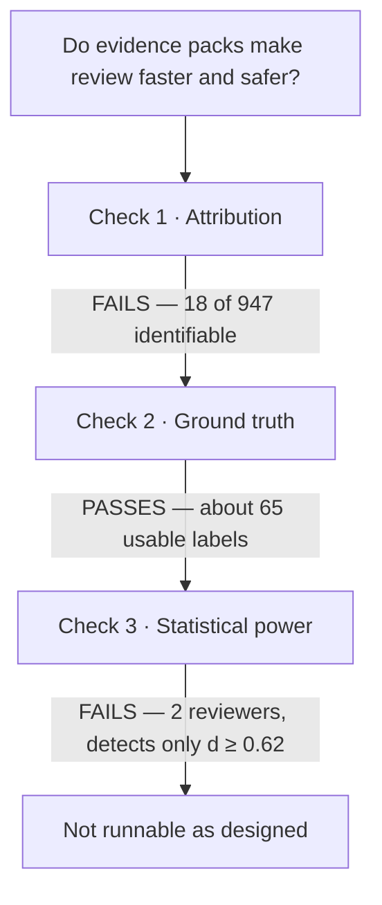

Out of 947 merged pull requests, I could prove that exactly 18 were written by an AI agent. My team runs agents every day.

That gap is the whole story. If you are planning to measure how AI changes engineering at your company, the data you are quietly assuming exists probably does not, and the cheapest way to find out is three days of counting rather than three months of running.

## The experiment I wanted to run

You open a pull request that an agent wrote. Three hundred lines, a clean description, tests that pass. You have no idea which parts to actually read.

So you do what everyone does: you skim the diff, you trust the tests, and you approve. Or you read all of it and spend forty minutes on something that turned out to be fine. Neither feels like review.

The idea was to test a fix. Take 20 to 40 real agent-authored pull requests and build two versions of each: the raw PR, and the same PR with an evidence pack attached: a test plan, a before-and-after static analysis diff, a summary of why each change was made, and links from each change back to the spec clause it implements.

Randomize which reviewer sees which version. Measure three things: how long the review takes, how many real defects get found, and how often a broken PR gets waved through.

It is a clean design. I did not get to run it.

Three things have to be true before that design produces a number worth reading. I checked them in order, and the order turned out to matter.

## Check one: can you even tell which PRs an agent wrote?

Nineteen out of every thousand. That is the share of merged pull requests I could attribute to an agent with any confidence: 18 out of 947, across two repositories over six months.

The commit trailer that would have made this trivial appears on about 0.7% of backend commits and 1.0% of frontend ones. The session link that would have tied a PR to an actual agent transcript has never been written in either repository. Not rarely. Never, in 5,688 merged pull requests, going back to the beginning.

<figure class="bars">
<figcaption>Merged pull requests, narrowing to what could actually be labelled</figcaption>

Merged, all time5,688

Merged in window947

Day-to-day work714

Attributable to an agent18

</figure>

The reason is entirely mundane. Somebody decided the trailer was noise in the commit log and turned it off, which is a completely reasonable thing to decide. Nothing else fills the gap: branch names encode the ticket type, there are no labels, and agents commit as the human who ran them.

Attribution has to be instrumented before the fact. You cannot reconstruct it afterwards from a repository that was not asked to record it. This is the finding I would go back and tell myself first.

## Check two: can you tell which PRs were broken?

This one passed, and it passed in a way I did not expect.

I spent the first morning on reverts, which is the obvious path and the wrong one. Searching PR titles for "revert" returned two hits and both were false. One was a hand-written re-implementation, the other a rename. That is worse than finding nothing: for an hour I had two rows in a spreadsheet that looked like data.

The real revert commits number six in six months, and only one resolves cleanly back to the PR that introduced the problem. This team reverts *inside* a branch before merging, so the bad commit never becomes part of a merged PR at all.

What worked was blame. For each fix PR, take the lines it deleted, blame them against the parent commit, and map the result back to the PR that wrote them. That is SZZ, more or less. On a random sample of 24 fix PRs, 37.5% produced a clean, unambiguous parent. I read six of them by hand: four clearly right, one clearly wrong, one arguable.

Six cases is a smell test, and I want to be honest that the 70-80% number I have been quoting rests on it. The one clear miss is instructive: the fix repaired a test whose assumption an earlier change had broken, and blame pointed confidently at the PR that had *written* the test. SZZ blaming the victim. Anything built on this needs a human reading every pair, which is fine at 40 and impossible at 400.

The failure mode is worth naming, because it is not SZZ's fault. Both repositories were re-imported as a single squashed commit earlier this year, so any blame that lands on older code resolves to that one import, which carries the entire pre-history and tells you nothing. Nine of the eleven degenerate cases were that. There is a hard floor under this kind of archaeology, and it is wherever your repo's history was last flattened.

The strongest signal was something else entirely: 28 fix PRs whose description explicitly names the earlier PR that broke the thing. Validated against merge order and file overlap, 27 of those 28 are correct pairings. Near-oracle labels, written by hand, for free.

## The labels exist because of the thing I was trying to measure

Except they are not written by hand.

Those 28 descriptions are that thorough because the team writes them with agent help. A typical one says, in the body of the fix, that the earlier PR closed the leak past the end of a tenant's own records but left it open inside the block, naming the exact boundary the first attempt got wrong. That is a better defect label than I could have written from the outside, and no human sat down and typed it unassisted.

My best ground truth is a *product* of agent-assisted work. The variable I wanted to study is the same variable that generated my measuring instrument.

Two consequences, and neither is small. The first is that my labels are not independent of my treatment. The very repositories where agents write thorough descriptions are the only repositories where this method works, so I cannot use them to ask whether agent-written PRs are worse. The second is that none of it transfers. A team that writes terse PR descriptions has no ground truth at all here, which means this method finds defects exactly where the culture already documents them, and goes blind everywhere else.

I did not see this until I had already built the extraction script and was pleased with it. That is the part I would warn someone about: a signal that is unusually clean is worth being suspicious of, because clean signals usually mean something upstream is generating them for you.

## Check three: is there enough signal to detect anything?

Six people have ever approved a pull request here. Two of them do substantive technical review.

That number is the experiment. Everything downstream is arithmetic, and the arithmetic is brutal.

Across 695 pull requests there are 1,522 review threads, which sounds healthy until you look at the distribution. The median PR has zero. 54% have zero. And 222 of them, nearly a third, were merged with no approval and no comment from anyone, most of those being the lead merging their own work, which is a normal thing for a lead to do and a fatal thing for a study to depend on.

One approver has 114 approvals, 25 comments in their entire history, and 83% of their approvals carry no discussion at all. That is a manager clearing an approval gate. They would contribute exactly nothing to the measurement.

Run the power calculation on what is left. With 40 PRs in the strongest design available, every PR reviewed by both reviewers with the arms swapped, the smallest effect detectable at 80% power is around d = 0.62. Translated into the actual outcome: the evidence pack would have to cut review time roughly in half before I could distinguish it from noise.

| PRs | Design | Smallest detectable effect |
|---|---|---|
| 20 | parallel, 10 per arm | d = 1.25 |
| 30 | parallel, 15 per arm | d = 1.02 |
| 40 | parallel, 20 per arm | d = 0.89 |
| 40 | within-reviewer crossover | d = 0.74 |
| 40 | within-PR crossover | d = 0.62 |

By convention d = 0.8 is a "large" effect. Every row of that table is asking the evidence pack to do something dramatic before I could see it at all.

If the real effect is a respectable 15% time saving, I would need something like 350 pull requests. That is about a year of this team's entire output.

And the false-approval rate, the outcome I cared about most, is not measurable at all. It is a binary event with an unknown, low base rate and twenty observations per arm. The only way to reach it is to stop waiting for natural defects and plant them. Two or three seeded bugs per PR turns forty coin flips into a few hundred, and turns "defects found" from a judgement call into a score.

## The confound that would have survived all of it

This one would have wasted the three months even if every check above had passed.

Read the two real reviewers' comments and they are already structured like machine output: severity headers, "ran the affected tests locally, 6 of 6 pass", "git grep returns zero matches for this symbol". These people review with AI assistance today.

So the "no evidence pack" arm is not an unassisted human baseline. It is a second AI-assisted condition with the assistance pointed somewhere else. Whatever number came out the far end, it would not have answered the question I thought I was asking.

## What I found instead

I went looking for an experiment and came back with a description of how this team actually reviews code, which turned out to be worth more.

I read a random sample of 18 review threads and sorted them by what they actually were:

| What the thread was | Share |
|---|---|
| A real defect | 33% |
| A nit or style point | 28% |
| Process chatter | 28% |
| A design question | 11% |

So counting threads does not count quality. An evidence pack could easily *raise* the thread count while changing nothing that matters, and process chatter is exactly the category it would inflate.

Which raises a harder question than the one I started with. If the median review leaves no written trace, then whatever review is actually doing here is invisible to every metric I could reach, including the ones I was about to build an experiment on top of.

These are uncomfortable facts about a functioning team shipping real software, and they were sitting in an API that anyone could have queried at any point in the last six months.

## What this cost, and what it saved

Three days of read-only API calls and git archaeology, against a study that would have run for three months and produced a null result I could not have interpreted.

The thing that kills your experiment is rarely the thing you were worried about. I was worried about recruiting reviewers; what actually killed it was a commit trailer somebody switched off, for good reasons, at some point nobody recorded. Before you design the measurement, go and count the labels you are assuming exist. It takes an afternoon, and it is the one step that can save you the whole project.
